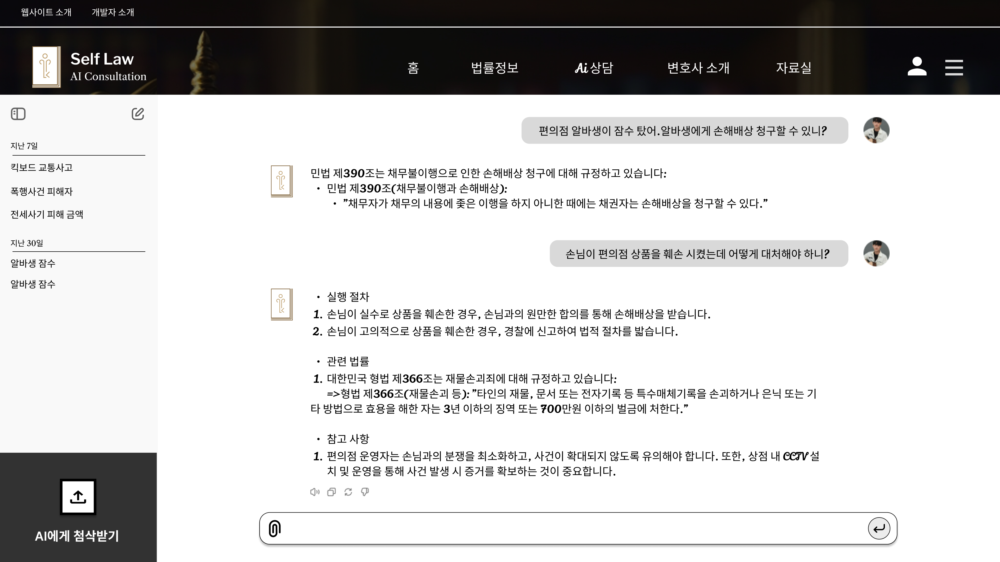
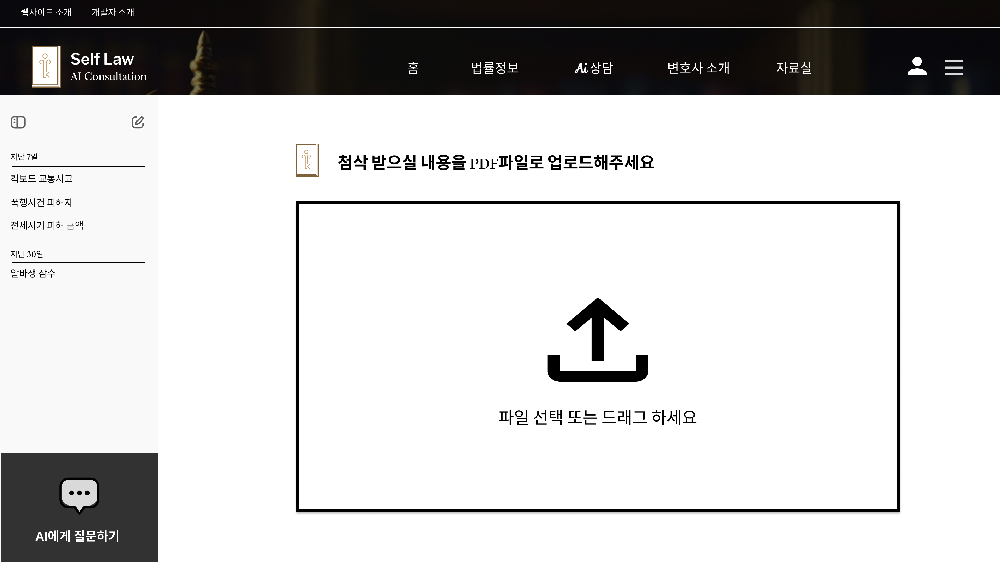
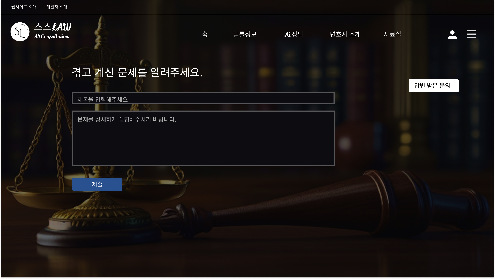
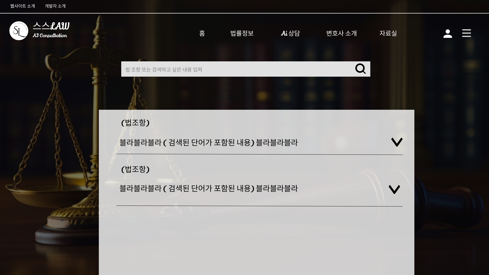

<div align="center">

<!-- logo -->


### SSL Front-end Reamd.me ✅

<br/> []()

</div>

**🔍 목차**

- 1. 프로젝트 소개
- 2. 프로젝트 팀원
- 3. 주요 기능
- 4. 프로젝트 프로토타입
- 5. 사용 패턴 & API
- 6. 사용한 기술 스택
- 7. 프로젝트 아키텍쳐
- 8. ERD
- 9. 커밋 컨벤션
- 10. 기술적 이슈와 해결 과정

## 1. 📝 소개

**Self Servicing Law Project** <br/>

- **프로젝트 이름**: SSL
- **프로젝트 설명**: 법률 상담 AI 서비스
- **프로젝트 특징**: 법률 지식을 학습한 AI와의 채팅 상담을 통한 법률 상담 서비스를 제공하며, 법률 서류를 생성/첨삭하는 기능 제공

<br />

## 2. 💁‍♂️ 프로젝트 팀원

|                                                 Frontend 팀원                                                  |                                         Frontend 팀원                                          |
| :------------------------------------------------------------------------------------------------------------: | :--------------------------------------------------------------------------------------------: |
|                                                                                  |                                                                  |
|                                    [박정우](https://github.com/jungwoo0601)                                    |                             [강재훈](https://github.com/bbalabuya)                             |
| 소셜 회원가입/로그인<br>AI 질문<br>서류 첨삭/생성 <br>문의/건의<br>법률정보 검색<br>소송장 관리<br>소송장 관리 | 소셜 회원가입/로그인<br>AI 질문<br>서류 첨삭/생성<br>문의/건의<br>법률정보 검색<br>소송장 관리 |

## 3. 💡 주요 기능

- OAuth 2.0을 이용한 소셜 로그인 기능
  - Google, Kakao, Naver 소셜 로그인 구현
  - JWT를 활용한 사용자 인증 및 권한 관리
- AI 법률 상담 기능
  - 채팅 형식의 AI 법률사항 응답 기능
  - Redis를 활용한 메시지 퍼블리싱 및 WebFlux 기반 비동기 API 설계를 통해 상담 서비스 구현
- 서류 첨삭/생성 기능
  - AI API 연동을 통해 서류 첨삭 및 서류 생성 기능 구현
  - 기존에 작성한 법률 서류를 AI가 첨삭
  - 사용자가 작성한 양식에 따라 AI가 서류 생성
- 변호사 알선 서비스
  - 분야별 변호사 소개 및 알선
- 문의/건의 서비스
  - 사용자의 문의/건의 사항을 받고 관리자가 답변

<br />

## 4. 📁 src 폴더 구조

```
┣ 📂components
┃ ┣ 📜Footer.js
┃ ┗ 📜Header.js
┣ 📂pages
┃ ┣ 📂About
┃ ┃ ┣ 📜AboutContent.js
┃ ┃ ┗ 📜AboutPage.js
┃ ┣ 📂admin
┃ ┃ ┣ 📜addLawyer.js
┃ ┃ ┣ 📜adminMenu.js
┃ ┃ ┣ 📜answer.js
┃ ┃ ┣ 📜editLawyer.js
┃ ┃ ┗ 📜lawyerInfo.js
┃ ┣ 📂chat
┃ ┃ ┣ 📜chatContent.js
┃ ┃ ┗ 📜chatPage.js
┃ ┣ 📂Choicechat
┃ ┃ ┣ 📜ChoiceCs.js
┃ ┃ ┗ 📜ChoicePage.js
┃ ┣ 📂document
┃ ┃ ┣ 📜DocumentContent.js
┃ ┃ ┗ 📜DocumentPage.js
┃ ┣ 📂edit
┃ ┃ ┣ 📜editContent.js
┃ ┃ ┗ 📜editPage.js
┃ ┣ 📂fandq
┃ ┃ ┣ 📜fandqContent.js
┃ ┃ ┗ 📜fandqPage.js
┃ ┣ 📂faq
┃ ┃ ┣ 📜faqContent.js
┃ ┃ ┗ 📜faqPage.js
┃ ┣ 📂Home
┃ ┃ ┣ 📜App.css
┃ ┃ ┣ 📜App.js
┃ ┃ ┣ 📜BottomNavigation.js
┃ ┃ ┣ 📜chatpage.js
┃ ┃ ┣ 📜Header.js
┃ ┃ ┣ 📜HomePage.js
┃ ┃ ┣ 📜HotPost.js
┃ ┃ ┣ 📜MainContent.js
┃ ┃ ┣ 📜Post.js
┃ ┃ ┣ 📜PostDetail.css
┃ ┃ ┣ 📜PostDetail.js
┃ ┃ ┗ 📜Tabs.js
┃ ┣ 📂inquiry
┃ ┃ ┣ 📜answered.js
┃ ┃ ┣ 📜inquiryContent.js
┃ ┃ ┗ 📜inquiryPage.js
┃ ┣ 📂IntroLawyers
┃ ┃ ┣ 📜IntroLawyerContent.js
┃ ┃ ┗ 📜IntroLawyerPage.js
┃ ┣ 📂Login
┃ ┃ ┣ 📜AdminPage.js
┃ ┃ ┣ 📜KakaoCallbackPage.js
┃ ┃ ┣ 📜LoginContent.js
┃ ┃ ┗ 📜LoginPage.js
┃ ┣ 📂search
┃ ┃ ┣ 📜searchContent.js
┃ ┃ ┗ 📜searchPage.js
┃ ┣ 📂styles
┃ ┃ ┣ 📜GlobalStyles.js
┃ ┃ ┣ 📜Joinpage.module.css
┃ ┃ ┣ 📜Joinpage2.module.css
┃ ┃ ┣ 📜Mypage.css
┃ ┃ ┗ 📜writePage.css
┃ ┣ 📂useRules
┃ ┃ ┣ 📜useRulesContent.js
┃ ┃ ┗ 📜useRulesPage.js
┃ ┣ 📂withdrawl
┃ ┃ ┣ 📜withdrawlContent.js
┃ ┃ ┗ 📜withdrawlPage.js
┃ ┣ 📜GetToken.js
┃ ┗ 📜make.js
┣ 📜App.css
┣ 📜App.js
┣ 📜index.css
┗ 📜index.js

```

<br />

## 5. 프로토타입

| 📜 메인 페이지 구성                       |
| ----------------------------------------- |
|  |

- 사용자가 게임에 참여하기 전, 게임 규칙을 확인하고 로비에 접속하는 화면입니다.
- '게임 시작' 버튼을 누르면 바로 로비로 접속합니다.

<br>
<br>

| 🛠️ 로그인 및 회원가입                       |
| ------------------------------------------- |
|  |

<br>
<br>

| 👥 질문, 첨삭 선택                          |
| ------------------------------------------- |
|  |

<br>
<br>

| 🃏 AI 법률 상담                              |
| -------------------------------------------- |
|  |

<br>
<br>

| 🎯 첨삭 업로드 기능                       |
| ----------------------------------------- |
|  |

<br>
<br>

| 📊 변호사 소개                              |
| ------------------------------------------- |
|  |

<br>
<br>

| 📜 소송장 관리                              |
| ------------------------------------------- |
|  |

<br>
<br>

| 🛠️ 관리자 코드                             |
| ------------------------------------------ |
|  |

<br>
<br>

| 👥 문의 답변 (관리자 입장)                     |
| ---------------------------------------------- |
|  |

<br>
<br>

| 🎯 소송장 관리                          |
| --------------------------------------- |
|  |

<br>
<br>

| 🏆 법률정보 검색                               |
| ---------------------------------------------- |
|  |

<br>
<br>

<br />

## 6. 🗂️ APIs

작성한 API는 아래에서 확인할 수 있습니다.

👉🏻 [API 바로보기](https://documenter.getpostman.com/view/36828826/2sA3s4nWHA)

<br />

## 7. ⚙ 기술 스택

### Front-end

<div>


</div>

### Infra

<div>
<br/>
- AWS EC2, RDS, S3, Route 53, ELB ...
</div>

### Tools

<div>


</div>

<br />

## 8. 🛠️ 프로젝트 아키텍쳐


## 9. ERD


<br/>

## 10. 커밋 컨벤션

**기본 구조**

```
type: subject

body
```

**type 종류**

```
feat: 새로운 기능을 추가할 경우
fix: 버그를 고친 경우
refactor: 프로덕션 코드 리팩토링의 경우
comment: 필요한 주석 추가 및 수정의 경우
docs: 문서를 수정한 경우
test: 테스트 추가, 테스트 리팩토링의 경우
chore: 빌드 태스트 업데이트, 패키지 매니저를 설정한 경우
rename: 파일 혹은 폴더명을 수정하거나 옮기는 경우
remove: 파일을 삭제하는 경우
style: 코드 포맷 변경, 코드 수정이 없는 경우
!BREAKING CHANGE!: 커다란 API 변경의 경우
```

**커밋 예시**

```
== ex1
feat: 로그인 기능 구현

Email 중복확인 api 개발

== ex2
fix: 사용자 정보 누락 버그 해결

사용자 서비스 코드 수정
```

<br />

## 11. 🤔 기술적 이슈와 해결 과정 (프론트엔드, 백엔드)

- WebSocket, SSE 역할에 대한 고민
  - [[시행착오] 대화형 AI와 백엔드가 소통하는 경우 WebSocket, SSE 중 무엇을 사용해야할까?](https://velog.io/@pp8817/시행착오-대화형-AI와-백엔드가-소통하는-경우-WebSocket-SSE-중-무엇을-사용해야할까)
- 외부 API 통신시 WebClient를 사용한 이유
  - [[시행착오] 외부 API 통신시 RestTemplate를 사용하지 않고 WebClient를 사용한 이유](https://velog.io/@pp8817/시행착오-외부-API-통신시-RestTemplate를-사용하지-않고-WebClient를-사용한-이유)
- 서버 배포시 Cookie 전송 문제 해결 With SameSite
  - [[시행착오] 서버 배포 시 Cookie 통신이 안되는 문제 With SameSite](https://velog.io/@pp8817/Cookie-SameSite-문제해결)
- Spring WebFlux를 사용한 비동기 처리
  - [✏️ [Java] Spring WebFlux - 비동기 처리 이해하기](https://velog.io/@pp8817/Java-Spring-WebFlux-비동기-처리-이해하기)
- AWS로 배포하기
  - [[시행착오] AWS 프리티어 비용 과금 이슈, 해결 방법](https://velog.io/@pp8817/Project-AWS-프리티어-비용-과금-이슈-해결-방법)

<br />
